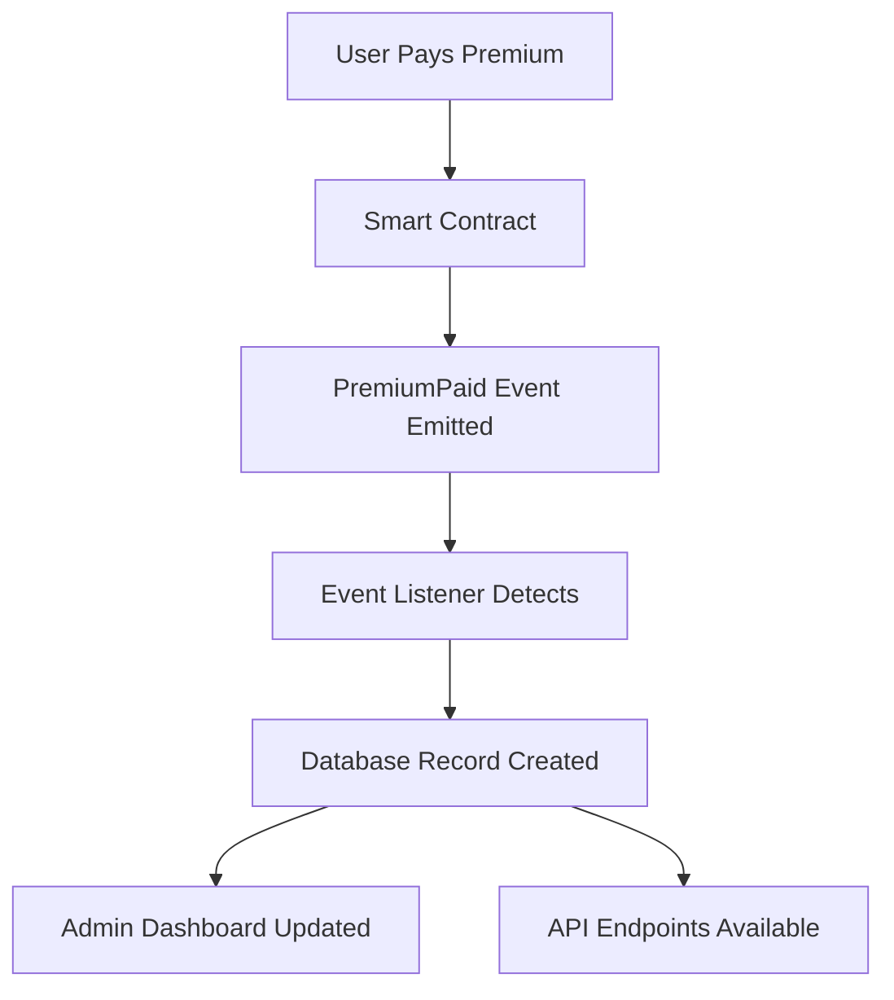

# Premium Payment Data Storage Guide

## 📊 Where Premium Payment Data is Stored

### 1. **Primary Storage: Blockchain (Immutable)**

**Location**: Ethereum blockchain via smart contract
- **Contract**: [`HealthInsurance.sol`](contracts/HealthInsurance.sol)
- **Event**: [`PremiumPaid`](contracts/HealthInsurance.sol:19) emitted on successful payment
- **Data Stored**:
  ```solidity
  event PremiumPaid(address indexed buyer, uint256 amount, uint256 timestamp);
  ```
  - `buyer`: Wallet address of the payer (indexed for efficient querying)
  - `amount`: Payment amount in wei (1 ETH = 10^18 wei)
  - `timestamp`: Block timestamp when payment was made

**Advantages**:
- ✅ Immutable and tamper-proof
- ✅ Decentralized and transparent
- ✅ Cryptographically secured
- ✅ Publicly verifiable

### 2. **Secondary Storage: Database (Queryable)**

**Location**: Django PostgreSQL database
- **Model**: [`Premium`](backend/insurance/models.py:110) 
- **Table**: `insurance_premium`

**Complete Data Schema**:
```python
class Premium(models.Model):
    id = UUIDField()                    # Unique identifier
    buyer = ForeignKey(Buyer)           # Link to buyer record
    policy = ForeignKey(Policy)         # Link to policy record
    
    # Blockchain data
    transaction_hash = CharField(66)    # Ethereum transaction hash
    amount_eth = DecimalField()         # Amount in ETH (human readable)
    amount_wei = CharField(100)         # Amount in wei (precise)
    block_number = BigIntegerField()    # Block number
    block_timestamp = DateTimeField()   # When payment occurred
    
    # Transaction details
    gas_used = BigIntegerField()        # Gas consumed
    gas_price = CharField(100)          # Gas price in wei
    
    # Status tracking
    status = CharField()                # confirmed/pending/failed
    created_at = DateTimeField()        # When record was created
```

**Advantages**:
- ✅ Fast querying and filtering
- ✅ Relational data with buyers/policies
- ✅ Rich metadata storage
- ✅ Admin interface for management
- ✅ API endpoints for frontend

### 3. **Data Synchronization Flow**



**Process**:
1. **Payment Initiated**: User clicks "Pay Premium" in frontend
2. **Blockchain Transaction**: [`payPremium()`](contracts/HealthInsurance.sol:36) function called
3. **Event Emission**: [`PremiumPaid`](contracts/HealthInsurance.sol:39) event emitted
4. **Event Detection**: [`handle_premium_paid()`](backend/insurance/event_listener.py:51) catches event
5. **Database Storage**: [`Premium`](backend/insurance/models.py:110) record created
6. **Policy Update**: Associated [`Policy`](backend/insurance/models.py:30) status updated

### 4. **Data Access Points**

#### **For Admins**:
- **Django Admin**: `/admin/insurance/premium/`
- **Admin Dashboard**: Registration tab shows payment history
- **Direct Database**: PostgreSQL queries

#### **For Developers**:
- **Event Logs**: Blockchain event queries
- **API Endpoints**: Django REST framework
- **Database ORM**: Django model queries

#### **For Users**:
- **Buyer Dashboard**: Payment status and history
- **Blockchain Explorer**: Transaction verification

### 5. **Data Redundancy & Reliability**

**Multiple Storage Layers**:
1. **Blockchain**: Permanent, immutable record
2. **Database**: Fast access, rich queries
3. **Event Logs**: Blockchain event history
4. **Transaction Receipts**: Detailed gas/fee information

**Data Integrity**:
- Transaction hash links blockchain to database
- Event listener ensures synchronization
- Database constraints prevent duplicates
- Status tracking for failed transactions

### 6. **Query Examples**

#### **Get All Payments for a Buyer**:
```python
buyer = Buyer.objects.get(wallet_address="0x70997970C51812dc3A010C7d01b50e0d17dc79C8")
payments = Premium.objects.filter(buyer=buyer).order_by('-created_at')
```

#### **Get Payment by Transaction Hash**:
```python
payment = Premium.objects.get(transaction_hash="0xabc123...")
```

#### **Get Monthly Payment Summary**:
```python
from django.db.models import Sum
monthly_total = Premium.objects.filter(
    block_timestamp__month=1,
    status='confirmed'
).aggregate(Sum('amount_eth'))
```

### 7. **Backup & Recovery**

**Blockchain Data**: 
- Automatically backed up across all Ethereum nodes
- Can be recovered from any blockchain explorer
- Event logs are permanent and immutable

**Database Data**:
- Regular PostgreSQL backups
- Can be reconstructed from blockchain events
- Event listener can replay historical events

### 8. **Privacy & Security**

**On-Chain Data**:
- Wallet addresses are pseudonymous
- Payment amounts are public
- No personal information stored

**Off-Chain Data**:
- Personal details in database only
- Encrypted sensitive information
- Access controls via Django admin

### 9. **Monitoring & Analytics**

**Real-time Monitoring**:
- Event listener logs all payments
- Database triggers for notifications
- Admin dashboard shows live statistics

**Analytics Available**:
- Payment volume trends
- Buyer payment history
- Gas cost analysis
- Success/failure rates

### 10. **Migration Commands**

To set up the Premium model:

```bash
# Create and apply migration
python manage.py makemigrations
python manage.py migrate

# Start event listener
python manage.py shell
>>> from insurance.event_listener import listen_to_events
>>> listen_to_events()
```

## 🔍 Verification

To verify payment storage is working:

1. **Check Blockchain**: Look for `PremiumPaid` events
2. **Check Database**: Query `Premium` model
3. **Check Admin**: View payments in Django admin
4. **Check Logs**: Event listener console output

The system now provides comprehensive, redundant storage of all premium payment data with both blockchain immutability and database queryability.